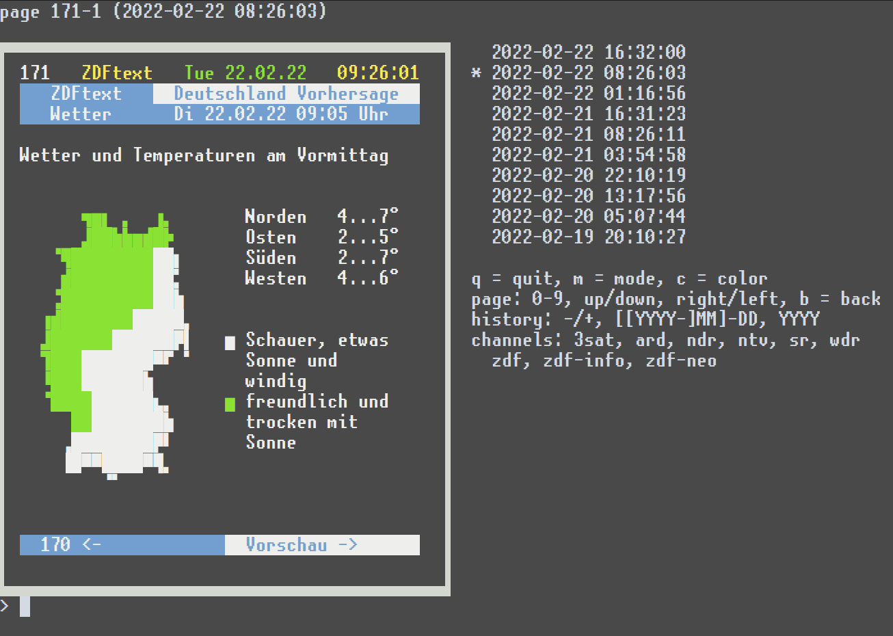
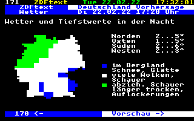
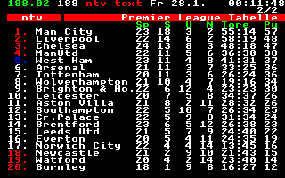
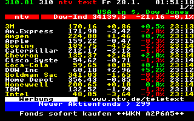
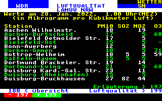

# archive of (german) online teletexts

Or *videotext*, as we used to call it. 

[](https://github.com/defgsus/teletext-archive-2025/actions/workflows/scraper.yml)

This repo uses github actions to scrape teletext pages from 
web sources and converts the html into easy digestible json/unicode files. 

The data is stored in [docs/snapshots](docs/snapshots) in a new-line 
delimited json file for each station. 


### scraped stations:

| station                                                     | since      | type               | link                                                                         |
|:------------------------------------------------------------|:-----------|:-------------------|:-----------------------------------------------------------------------------|
| ✔&nbsp;[3sat](docs/snapshots/3sat.ndjson)                   | 2022-01-28 | html with font-map | https://blog.3sat.de/ttx/                                                    |
| ✔&nbsp;[ARD](docs/snapshots/ard.ndjson)                     | 2022-01-28 | html               | https://www.ard-text.de/                                                     |
| ✔&nbsp;[NDR](docs/snapshots/ndr.ndjson)&nbsp;`ϰ`            | 2022-01-27 | html               | https://www.ndr.de/fernsehen/videotext/index.html                            |
| ✔&nbsp;[n-tv](docs/snapshots/ntv.ndjson)                    | 2022-01-28 | json               | https://www.n-tv.de/mediathek/teletext/                                      |
| ✔&nbsp;[SR](docs/snapshots/sr.ndjson)                       | 2022-01-28 | html               | https://www.saartext.de/                                                     |
| ✔&nbsp;[SWR&nbsp;BW](docs/snapshots/swr_bw.ndjson)&nbsp;`ϕ` | 2025-08-02 | html               | https://www.swr.de/video/videotext/swrfernsehen-videotext-bw-100.html        |
| ✔&nbsp;[SWR&nbsp;RP](docs/snapshots/swr_bw.ndjson)&nbsp;`ϕ` | 2025-08-02 | html               | https://www.swr.de/video/videotext/swrfernsehen-videotext-rp-100.html        |
| ✔&nbsp;[WDR](docs/snapshots/wdr.ndjson)                     | 2022-01-28 | html               | https://www1.wdr.de/wdrtext/index.html                                       |
| ✔&nbsp;[ZDF](docs/snapshots/zdf.ndjson)                     | 2022-01-27 | html               | https://teletext.zdf.de/teletext/zdf/                                        |
| ✔&nbsp;[ZDFinfo](docs/snapshots/zdf-info.ndjson)            | 2022-01-27 | html               | https://teletext.zdf.de/teletext/zdfinfo/                                    |
| ✔&nbsp;[ZDFneo](docs/snapshots/zdf-neo.ndjson)              | 2022-01-27 | html               | https://teletext.zdf.de/teletext/zdfneo/                                     |

- `ϕ`: Thanks to [@fabianswebworld](https://github.com/fabianswebworld) :)
- `ϰ`: NDR officially stopped serving teletext pages on the website in beginning of 2025,
  but the internal page URLs are still working. Though, there is some bad encoding in the snapshots for quite a period!

### :star: view it :star:

Setup a python env, install `requirements.txt` and call `python show.py`.



You can browse pages *horizontally* and *vertically*, 
meaning **through history**.
The snapshots are loaded from the git repo in the back. There are about
3 snapshots per day.

 

 


### format

Each line is one complete json object. 
Each file starts with a simple line like this. All timestamps are UTC.
```json
{"scraper":"3sat","timestamp":"2022-02-05T04:09:36"}
```

Then each page starts like this:
```json
{"page":100,"sub_page":1,"timestamp":"2022-02-05T04:09:36"}
```

and is followed by lines of content like this:
```json lines
[["wb","  "],["rb","🬦🬚🬋🬋🬩🬚🬹 "],["bb","🬞🬭🬏 🬭🬭 🬻🬭                     "]]
[["wb","  "],["rb","▐█🬱🬵🬆🬵█ "],["bb","█🬒🬎🬉🬆🬨▌█🬂 "],["rb","                    "]]
[["wb","  "],["rb","▐█🬝🬟🬜██ "],["bb","🬁🬬🬱🬞🬜🬬▌█  "],["rb","                    "]]
[["wb","  "],["rb","▐█🬬█🬱🬁█ "],["bb","🬬🬹🬝🬉🬺🬜▌🬬🬜 "],["rb","                    "]]
[["wb","  "],["rb","▐🬲🬁🬎🬎🬞█                               "]]
[["wb","  "],["rb","🬉🬎🬌🬋🬋🬎🬎                               "]]
[["wb","  "],["rb","🬂🬂🬂🬂🬂🬂🬂🬂🬂🬂🬂🬂🬂🬂🬂🬂🬂🬂🬂🬂🬂🬂🬂🬂🬂🬂🬂🬂🬂🬂🬂🬂🬂🬂🬂🬂🬂 "]]
[["wb","  "],["rb","502 "],["bb","Köln will Benin-Bronzen           "]]
[["wb","  "],["rb","    "],["bb","zurückgeben                       "]]
[["wb","  "],["rb","401 "],["bb","Wetterwerte und Prognosen         "]]
[["wb","  "],["rb","525 "],["bb","Theater und Konzerte Österreich   "]]
[["wb","  "],["rb","555 "],["bb","Buchtipps und Literatur           "]]
[["wb","  "],["rb","🬭🬭🬭🬭🬭🬭🬭🬭🬭🬭🬭🬭🬭🬭🬭🬭🬭🬭🬭🬭🬭🬭🬭🬭🬭🬭🬭🬭🬭🬭🬭🬭🬭🬭🬭🬭🬭 "]]
[["wb","    "],["rb","Jetzt in 3sat                       "]]
[["wb","  "],["rb","  "],["wb","04:39 Kurzstrecke mit Pierre M.     "]]
[["wb","  "],["rb","        "],["wb","Krause ................. 343  "]]
[["wb","  "],["rb","  "],["wb","05:01 Kurzstrecke mit Pierre M.     "]]
[["wb","  "],["rb","        "],["wb","Krause ................. 344  "]]
[["wb","                                        "]]
[["wb","  "],["rb","🬋🬋🬋 "],["bb","Nachrichten     200 Sport         "]]
[["wb","  "],["bb","112 Deutschland     300 Programm      "]]
[["wb","  "],["bb","150 Österreich      400 Wetter/Verkehr"]]
[["wb","  "],["bb","151 Schweiz         500 Kultur        "]]
[["wb","                                        "]]
[["wb","                                        "]]
```

Each content line consists of one or several blocks with color and text.
The two-letter color code represents foreground and background colors
(**b**lack, **r**ed, **g**reen, b**l**ue, **m**agenta, **c**yan, **w**hite).

A third argument might be in one block which would then be a link to another table:
```json lines
[["wb", 101, "Seite 101"]]
[["wb", [101, 5], "Seite 101/5"]]
```

If you can see the graphic blocks in the above example you have a font 
installed that supports the unicode
[symbols for legacy computing](https://en.wikipedia.org/wiki/Symbols_for_Legacy_Computing)
starting at `0x1bf00`. If not, you can install a font like 
[unscii](http://viznut.fi/unscii/).

The original character codes from the teletext pages are converted to 
the unicode mappings via 
[these tables](https://en.wikipedia.org/wiki/Teletext_character_set#Graphics_character_sets).


### technicals

- Scraping is currently done about every 8 hours. I'd love to leave this
running **forever** but need to watch the growing repository size. 
The [alpha version](https://github.com/defgsus/teletext-archive) exploded
in only a few weeks time.

- To walk the historical commits look at file 
  [docs/snapshots/zdf.ndjson](docs/snapshots/zdf.ndjson). It's been there
  since the beginning. For example, to list all commit timestamps and hashes:
  ```shell script
  git log --reverse --pretty='%aI %H' -- docs/snapshots/zdf.ndjson
  ```
  (However, the first 50 or so commits are replayed from another repo and the 
  timestamps do not fit the snapshot timestamps.) 
  
  A more convenient way is to read the contents of 
  [docs/snapshots/_timestamps.ndjson](docs/snapshots/_timestamps.ndjson) 
  which holds each snapshot commit hash and the actual snapshot timestamp.
  
  Knowing the commit hashes, one can read the files of each commit via:
  ```shell script
  git archive <hash> docs/snapshots > files.tar
  ```
  Each file contains the actual timestamp of the snapshot. 
  
- Not all special characters are decoded for each station. Currently they
are replaced by `?`.  

- Before 2022-02-21, the ZDF recordings have an encoding problem which i couldn't 
correctly fix afterwards. Parsing the ndjson files will actually result in 
some json decoding errors because of a spooky sequence like `96 c2 00 0a` after
the letter 'Ö'. Ignoring json errors and skipping those lines works. You'll just
miss some lines in the page content. However, other stupid character sequences
are in there as well and some lines might have more than 40 characters. 
Also the block graphics might be expurgated. 


### related stuff

Oh boy, look what else exists on the web: 

- https://archive.teletextarchaeologist.org
- http://teletext.mb21.co.uk/
- https://www.teletextart.com/
- https://galax.xyz/TELETEXT/
- https://zxnet.co.uk/teletext/viewer/
- https://github.com/mojoaxel/awesome-teletext
- 

## TODO

- there is at least one other character set with thinner box graphics. 
  it's not supported by unicode but it would be good to store 
  at least the charset switch
- unrecognized chars on **NTV 218**
- ZDF scraper report in commit message only shows *pages added*


## TODO other sites
     
- **KIKA** https://www.kika.de/kikatext/kikatext-start100.html

  They only deliver images 
    
- **Seven-One** https://www.sevenonemedia.de/tv/portfolio/teletext/teletext-viewer
  
  This is the Pro7/Sat1 empire. They have **a lot** of channels. All images :(

- **VOX** https://www.vox.de/cms/service/footer-navigation/teletext.html

  Requires .. aehm ... Flash :rofl:


### beyond the borders

- **CT** https://www.ceskatelevize.cz/teletext/ct/

  Images

- **Swiss Teletext** https://mobile.txt.ch/  
  
  Does not really seem to work - with my script-blockers anyways

- **SRF** https://www.teletext.ch/

  Images

- **ORF** https://teletext.orf.at/

  JSON API delivering ... image-urls

- **HRT** https://teletekst.hrt.hr/

  Images
  
- **RTVSLO** https://teletext.rtvslo.si/

  Images
  
- **NOS** https://nos.nl/teletekst

- **Supersport** https://www.supersport.hr/teletext/661

- **RTVFBiH** https://teletext.rtvfbih.ba/

  Images
  
- **??** https://www.teletext.hu/

  Many things i cannot read

- **TRT** https://www.trt.net.tr/Kurumsal/Teletext.aspx

  Not getting it to work
  
- **Markiza** https://markizatext.sk/
  
  Not getting it to work, either
  
- **RTP** https://www.rtp.pt/wportal/teletexto/

  Images
  
- **SVT** https://www.svt.se/text-tv/101

  Images
  
